# Especificación de Casos de Uso y Diagramas de Flujo del Sistema SIGER-FMC
## Sistema Integrado de Gestión Operativa y Control de Servicios Técnicos
### Franyer Mobile Center, S.R.L.

---

## 1. Introducción y Convenciones del Modelo

El presente documento formaliza la especificación funcional y técnica del comportamiento del sistema **SIGER-FMC** mediante el estándar de modelado UML (*Unified Modeling Language*) para **Casos de Uso** y **Diagramas de Flujo de Procesos Operativos (Flowcharts)**. 

El objetivo es definir con precisión las interacciones entre los actores del sistema (internos y externos), las fronteras de los servicios, los puntos de decisión condicional (`if/else`) y las secuencias temporales de ejecución, garantizando el cumplimiento de las políticas de negocio, el control de acceso basado en roles (**RBAC**), el aislamiento multi-sucursal y los mecanismos transversales de auditoría, seguridad e infraestructura multimedia.

### 1.1. Convenciones de Relaciones UML Empleadas
- **Asociación Actor - Caso de Uso (`──`):** Representa la participación activa del actor en la ejecución o consumo del caso de uso.
- **Inclusión (`<<include>>`):** Define un comportamiento obligatorio y no negociable que se ejecuta siempre como parte indispensable del flujo del caso de uso base.
- **Extensión (`<<extend>>`):** Define un comportamiento opcional, condicional o excepcional que complementa el caso de uso base bajo puntos de extensión o condiciones específicas del entorno de negocio.
- **Generalización de Actores (`──▷`):** Indica que un rol subordinado hereda capacidades o visibilidad de un rol de mayor privilegio o comparte características operativas comunes.

---

## 2. Catálogo y Taxonomía de Actores del Sistema

El sistema identifica de forma explícita a cinco (5) actores principales con fronteras de seguridad y responsabilidades operativas claramente delimitadas:

1. **SuperAdmin (Administrador General del Sistema):**
   - Actor con privilegios omnicanales absolutos. Puede acceder a todas las sucursales, supervisar la totalidad de órdenes, anular o editar tickets, gestionar el personal de cualquier sede y configurar los parámetros corporativos de la empresa matriz.
2. **Admin_Sucursal (Gerente / Administrador de Sede):**
   - Actor administrativo confinado a su sucursal fija asignada. Supervisa la mesa de trabajo de su taller, gestiona técnicos y secretarias locales, autoriza anulaciones locales, reasigna órdenes y aprueba incidencias con clientes.
3. **Secretaria / Recepción:**
   - Actor de atención directa en mostrador. Registra clientes, ingresa órdenes de servicio (`servicios_recepcion`), verifica garantías, gestiona el cobro de anticipos y emite comprobantes físicos térmicos y stickers adhesivos con código QR. Posee prohibición estricta de crear órdenes en nombre de técnicos y de anular tickets.
4. **Tecnico (Especialista de Laboratorio Técnico):**
   - Actor operativo de taller. Diagnostica averías, transiciona estados de reparación, visualiza claves/patrones de desbloqueo, reporta incidencias y piezas adicionales, y carga evidencias fotográficas de trabajo. Tiene **bloqueo estricto 403 Forbidden** para crear o editar órdenes en recepción.
5. **Cliente (Actor Externo):**
   - Consumidor final que consulta el estatus de su orden mediante el portal público vía código de ticket o escaneo de código QR, y autoriza o rechaza presupuestos de reparación.

---

## 3. Módulo 1: Autenticación y Seguridad (IAM)

Este módulo gestiona la verificación de identidad, la emisión y revocación de tokens JWT criptográficos, la protección contra automatizaciones maliciosas mediante Cloudflare Turnstile y el control de acceso en capas (RBAC + aislamiento de sucursal).

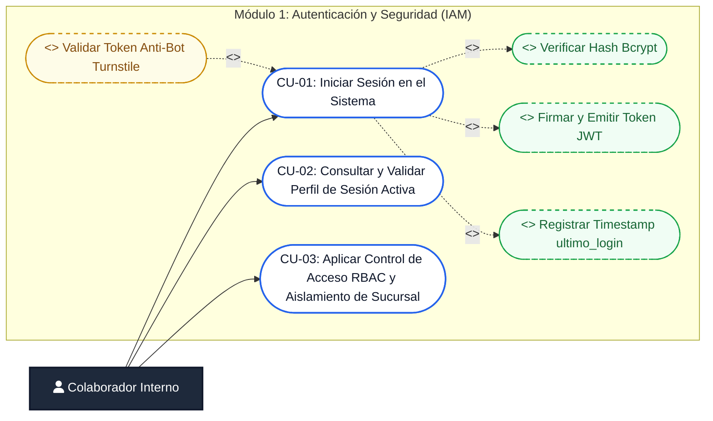

---

### CU-01: Iniciar Sesión en el Sistema
- **Actores:** SuperAdmin, Admin_Sucursal, Secretaria, Tecnico.
- **Precondiciones:** La cuenta debe encontrarse en estado activo (`activo = TRUE`).
- **Flujo Principal:**
  1. El usuario introduce nombre de usuario y contraseña en `LoginPage.jsx`.
  2. Si está habilitada la directiva `ENABLE_TURNSTILE`, el frontend valida el widget y remite el token correspondiente (**<<extend>> Validar Token Anti-Bot Turnstile**).
  3. El backend recibe la solicitud en `POST /api/auth/login`.
  4. Se consulta el registro en `datos_trabajadores` por usuario normalizado.
  5. Se comprueba la contraseña mediante comparación segura de hashes (**<<include>> Verificar Hash Bcrypt**).
  6. Se firma un token JWT criptográfico con payload de usuario, rol y sucursal (**<<include>> Firmar y Emitir Token JWT**).
  7. Se actualiza la estampa temporal en base de datos (**<<include>> Registrar Timestamp ultimo_login**).
  8. El cliente almacena el token en almacenamiento seguro y redirige al dashboard correspondiente.
- **Flujos Alternativos:**
  - *4a. Usuario inactivo o bloqueado:* Se rechaza el acceso con error HTTP `401 Unauthorized` (*"Usuario inactivo o suspendido"*).
  - *5a. Contraseña incorrecta:* Se rechaza con `401 Unauthorized`.
  - *2a. Falla en Turnstile:* Se deniega la solicitud con `403 Forbidden`.

---

### CU-02: Consultar y Validar Perfil de Sesión Activa
- **Actores:** Cualquier usuario autenticado.
- **Precondiciones:** Token JWT válido en la cabecera `Authorization: Bearer <token>`.
- **Flujo Principal:**
  1. El cliente ejecuta `GET /api/auth/profile` al montar la aplicación para hidratar el estado de `AuthContext`.
  2. El middleware `authMiddleware` valida firma, emisor y tiempo de expiración del token.
  3. Se consultan datos frescos del colaborador, incluyendo sucursal, rol y permisos actuales.
  4. Se responde con los metadatos de sesión y foto de perfil actualizada.
- **Flujos Alternativos:**
  - *2a. Token caducado o alterado:* Retorna `401 Unauthorized`, forzando la limpieza de sesión y redirección a login.

---

### CU-03: Aplicar Control de Acceso RBAC y Aislamiento de Sucursal
- **Actores:** Sistema / Middlewares de Red (`roleMiddleware`, `requireBranchAccess`).
- **Precondiciones:** Petición entrante autenticada.
- **Flujo Principal:**
  1. El middleware `roleMiddleware(rolesPermitidos)` intercepta la petición HTTP y evalúa si el rol del usuario forma parte de la lista blanca permitida.
  2. Si el rol no está autorizado, se aborta la ejecución retornando `403 Forbidden`.
  3. El middleware `requireBranchAccess` evalúa el nivel de omnicanalidad:
     - Si el rol es `SuperAdmin`, se autoriza el acceso transversal a todas las sedes (`req.isSuperAdmin = true`).
     - Para cualquier otro rol, se restringe la consulta inyectando automáticamente el predicado `WHERE sucursal_id = req.user.sucursal_id`.
  4. La petición continúa hacia el controlador de negocio correspondiente.

---

## 4. Módulo 2: Sucursales y Gestión de Personal

Este módulo soporta la arquitectura multi-sucursal de la empresa matriz (Franyer Mobile Center, S.R.L.), permitiendo gobernar la información institucional de las sedes operativas, administrar el personal técnico y administrativo, y consultar expedientes de colaboradores en vistas 360°.

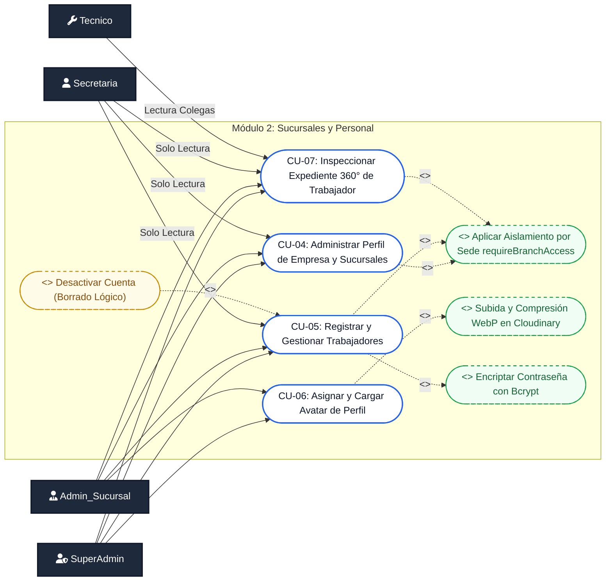

---

### CU-04: Administrar Perfil de Empresa y Sucursales
- **Actores:** SuperAdmin (edición total), Admin_Sucursal (edición local), Secretaria (solo lectura).
- **Precondiciones:** Usuario autenticado con permisos en `/api/configuracion`.
- **Flujo Principal:**
  1. El actor solicita el perfil institucional de la compañía o el listado de sucursales activas.
  2. Si el actor es `SuperAdmin`, puede actualizar datos fiscales (RNC, razón social, dirección principal) o el logotipo corporativo.
  3. Si el actor es `Admin_Sucursal`, solo puede modificar los datos de contacto (teléfono, dirección física, horario) de su sucursal fija asignada (**<<include>> Aplicar Aislamiento por Sede**).
  4. El sistema valida los datos y persiste los cambios en `datos_companhia` o `datos_sucursales`.
- **Flujos Alternativos:**
  - *3a. Intento de modificación cruzada:* Si un `Admin_Sucursal` intenta alterar una sede ajena, el backend responde con `403 Forbidden`.

---

### CU-05: Registrar y Gestionar Trabajadores
- **Actores:** SuperAdmin (global), Admin_Sucursal (local a su sede), Secretaria/Tecnico (solo lectura de colaboradores).
- **Precondiciones:** Sesión activa con rol administrativo.
- **Flujo Principal:**
  1. El actor completa el formulario con datos personales del trabajador (nombre, apellido, cédula, teléfono, correo, nombre de usuario, contraseña, rol asignado y sucursal).
  2. El sistema valida la unicidad de cédula, correo y usuario mediante consultas sobre `datos_trabajadores`.
  3. El sistema aplica hash a la contraseña con un factor de costo seguro (**<<include>> Encriptar Contraseña con Bcrypt**).
  4. Si el creador es `Admin_Sucursal`, el sistema bloquea cualquier asignación a una sede distinta a la suya (**<<include>> Aplicar Aislamiento por Sede**).
  5. Se inserta el registro y se retorna el expediente del trabajador.
- **Puntos de Extensión:**
  - El administrador puede inhabilitar temporalmente a un empleado sin destruir su historial operativo (**<<extend>> Desactivar Cuenta vía Borrado Lógico**).
- **Flujos Alternativos:**
  - *2a. Datos duplicados:* Si la cédula o usuario ya existen, se rechaza la transacción con código `409 Conflict`.

---

### CU-06: Asignar y Cargar Avatar de Perfil
- **Actores:** SuperAdmin, Admin_Sucursal.
- **Precondiciones:** Archivo de imagen válido (JPEG, PNG, WebP) recibido vía `multipart/form-data`.
- **Flujo Principal:**
  1. El usuario selecciona la fotografía del colaborador.
  2. El middleware de subida valida formato y peso (máximo 5MB).
  3. El buffer de la imagen se transmite al servicio en la nube (**<<include>> Subida y Compresión WebP en Cloudinary** en carpeta `siger-fmc/personal-fmc`).
  4. Se almacena la URL segura devuelta en `foto_perfil_url` de la tabla `datos_trabajadores`.

---

### CU-07: Inspeccionar Expediente 360° de Trabajador / Usuario
- **Actores:** SuperAdmin, Admin_Sucursal, Secretaria (solo lectura), Tecnico (lectura de colegas).
- **Componente Frontend:** `UsuarioDetalleModal.jsx`.
- **Precondiciones:** Usuario existente registrado en `datos_trabajadores`.
- **Flujo Principal:**
  1. El usuario hace clic en el botón de inspección o sobre la fila del colaborador en la tabla de personal (`WorkersPage.jsx`).
  2. El sistema despliega el modal de detalle 360° sin entrar en modo edición.
  3. El visor proyecta: avatar oficial de Cloudinary, credenciales públicas (usuario, rol, sucursal), contacto (cédula, teléfono, correo), métricas operativas de servicios técnicos asignados e historial de actividad.
  4. Permite alternar rápidamente al modal de edición o desactivación si el usuario cuenta con permisos administrativos.

---

## 5. Módulo 3: Recepción y Gestión Integral de Órdenes de Servicio

Este módulo gobierna el ciclo de mostrador: registro y consulta 360° de clientes, formalización de la orden de servicio (`servicios_recepcion`), inspección visual con checklist de entrada, validación estricta de fecha estimada de entrega, visor 360° de orden, edición controlada con matriz de congelación por estado, cancelación formal con guardas defensivas, validación de garantías y emisión de comprobantes físicos con códigos QR.

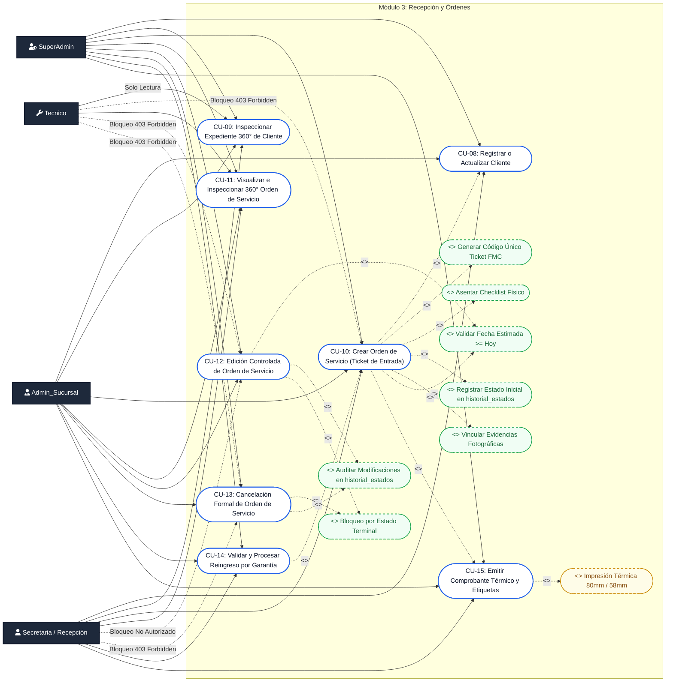

---

### CU-08: Registrar o Actualizar Cliente
- **Actores:** SuperAdmin, Admin_Sucursal, Secretaria. (Tecnico tiene acceso de solo lectura).
- **Precondiciones:** Usuario con permisos sobre `/api/clientes`.
- **Flujo Principal:**
  1. La recepcionista busca al cliente por Cédula/RNC, teléfono o nombre completo.
  2. Si el cliente ya existe, el sistema precarga sus datos en el formulario permitiendo actualizar teléfono, dirección o correo.
  3. Si no existe, se capturan los datos básicos y se inserta un nuevo registro en la tabla `clientes`.
  4. El sistema retorna el `cliente_id` verificado.

---

### CU-09: Inspeccionar Expediente 360° de Cliente
- **Actores:** SuperAdmin, Admin_Sucursal, Secretaria, Tecnico (solo lectura).
- **Componente Frontend:** `ClienteDetalleModal.jsx`.
- **Precondiciones:** Cliente registrado en la base de datos.
- **Flujo Principal:**
  1. El actor hace clic sobre el cliente o el botón de inspección en `ClientsPage.jsx`.
  2. El sistema abre el modal de detalle 360°:
     - Cabecera con nombre, documento de identidad (Cédula/RNC) y estado de cuenta.
     - Bloque de métricas: total de órdenes registradas, volumen de reparaciones finalizadas y monto acumulado.
     - Historial completo de tickets asociados con código, equipo, fecha, costo y estado.
     - Acciones directas para llamar, redactar correo o abrir órdenes relacionadas.

---

### CU-10: Crear Orden de Servicio (Ticket de Entrada)
- **Actores:** Secretaria, Admin_Sucursal, SuperAdmin.
- **Restricción Estricta:** El rol **`Tecnico`** posee bloqueo total (`403 Forbidden`: *"Los técnicos no tienen permisos para crear órdenes de servicio"*).
- **Precondiciones:** Cliente identificado y sucursal de recepción validada.
- **Flujo Principal:**
  1. La recepcionista captura los datos del equipo: categoría, marca, modelo, número de serie o código IMEI.
  2. Se registran las credenciales de acceso: patrón gestual de desbloqueo, código PIN o contraseña de usuario.
  3. Se asienta la falla reportada por el cliente, las observaciones cosméticas de ingreso y los accesorios entregados.
  4. Se completa la matriz interactiva de inspección (**<<include>> Asentar Checklist Físico de Componentes** clasificando cada elemento en *OK, Con Falla o Sin Revisar*).
  5. Se define el costo previsto, nivel de prioridad (`baja, media, alta, urgente`), monto de anticipo entregado en caja y fecha estimada de entrega (**<<include>> Validar Fecha Estimada >= Hoy**).
  6. Si se cargaron fotos (localmente o vía sesión QR), se adjuntan a la orden (**<<include>> Vincular Evidencias Fotográficas de Entrada**).
  7. El backend inicia una transacción atómica SQL (`BEGIN`):
     - Genera un código de ticket único secuencial (**<<include>> Generar Código Único Ticket FMC**).
     - Inserta el registro maestro en `servicios_recepcion` con estado `RECIBIDO` (`estado_actual_id = 1`).
     - Inserta el primer registro de auditoría en `historial_estados` con el usuario receptor (**<<include>> Registrar Estado Inicial en historial_estados**).
     - Persiste las fotografías en `evidencias_fotograficas` (`tipo_evidencia = 'RECEPCION'`).
     - Si las fotos provienen de una sesión QR, marca la sesión como `UTILIZADA` en `sesiones_carga_fotos`.
  8. Se confirma la transacción (`COMMIT`) y se retorna el ticket generado.
- **Puntos de Extensión:**
  - Al completar la creación, se ofrece la emisión física inmediata (**<<extend>> CU-15: Emitir Comprobante Térmico y Etiquetas Adhesivas**).
- **Flujos Alternativos:**
  - *Fecha en el pasado:* Si la recepcionista selecciona una fecha anterior a hoy, el formulario y el backend rechazan la solicitud con código `400 Bad Request`.
  - *Error en transacción:* Ante cualquier falla de concurrencia o inserción, se ejecuta `ROLLBACK` garantizando integridad total.

---

### CU-11: Visualizar e Inspeccionar 360° Orden de Servicio
- **Actores:** SuperAdmin, Admin_Sucursal, Secretaria, Tecnico.
- **Componente Frontend:** `OrdenDetalleModal.jsx`.
- **Precondiciones:** Orden de servicio existente.
- **Flujo Principal:**
  1. El actor hace clic sobre cualquier fila interactiva de la tabla de servicios en `ServiciosPage.jsx`.
  2. El sistema abre el modal de inspección integral 360° homologado:
     - Cabecera con número de ticket monoespaciado, fecha de recepción, cliente, recepcionista y sucursal.
     - Píldoras de Estado y Prioridad con colores semánticos y badges minimalistas.
     - Navegación por pestañas: Información General, Diagnóstico y Ficha Técnica, Evidencias Fotográficas (Recepción y Entrega), Historial Inmutable de Estados e Incidencias Técnicas.
     - Botón contextual para navegar directamente al Banco de Trabajo (`/taller?buscar=SFM-...`), oculto automáticamente si la orden está finalizada o cancelada.

---

### CU-12: Edición Controlada de Orden de Servicio
- **Actores:** SuperAdmin, Admin_Sucursal, admin, administrador. (Bloqueo para `Tecnico` y `Secretaria`).
- **Endpoint:** `PUT /api/servicios/:id`.
- **Componente Frontend:** `EditarOrdenModal.jsx`.
- **Precondiciones:** La orden debe estar activa y NO encontrarse en estados terminales (`ENTREGADO` o `CANCELADO_DEVUELTO`).
- **Flujo Principal:**
  1. El actor hace clic en "Editar Orden" en el menú de acciones de la tabla.
  2. El sistema consulta la orden y evalúa su estado de ciclo de vida:
     - **Si está en estado inicial (`RECIBIDO_REVISION`, `PENDIENTE_REVISION`):** Habilita la edición de campos descriptivos (marca, modelo, IMEI, categoría, falla reportada, costo estimado), credenciales de seguridad, fecha estimada, prioridad y observaciones.
     - **Si avanzó a taller (`EN_DIAGNOSTICO`, `EN_REPARACION`, etc.):** El hardware y la avería original quedan congelados en modo solo lectura (`readOnly`) mostrando un banner minimalista de advertencia. Solo permite actualizar credenciales de acceso (PIN/patrón), fecha estimada de entrega, prioridad, observaciones y accesorios.
  3. Se valida que la fecha estimada no sea anterior a hoy (**<<include>> Validar Fecha Estimada >= Hoy**).
  4. La asignación de técnicos no interviene en este formulario (responsabilidad exclusiva del Banco de Trabajo).
  5. El backend ejecuta la actualización SQL en transacción, registra el evento con la lista exacta de campos modificados (**<<include>> Auditar Modificaciones en historial_estados**) y retorna la orden enriquecida con todas sus relaciones.
- **Flujos Alternativos:**
  - *Orden terminal:* Si la orden ya fue entregada o cancelada, responde con `400 Bad Request` (**<<include>> Bloqueo por Estado Terminal**).
  - *Acceso no autorizado:* Si un técnico intenta invocar la ruta, se rechaza con `403 Forbidden`.

---

### CU-13: Cancelación Formal de Orden de Servicio y Salvaguardas Defensivas
- **Actores:** SuperAdmin, Admin_Sucursal exclusivamente. (Bloqueo terminante para `Tecnico` y `Secretaria`).
- **Endpoint:** `POST /api/servicios/:id/cancelar`.
- **Componente Frontend:** `CancelarOrdenModal.jsx`.
- **Precondiciones:** Orden activa no cancelada previamente ni entregada.
- **Flujo Principal:**
  1. El administrador selecciona "Cancelar Orden" en la tabla de servicios.
  2. El sistema abre el modal de cancelación solicitando obligatoriamente el motivo formal (mínimo 5 caracteres).
  3. El backend inicia una transacción atómica con bloqueo de fila (`FOR UPDATE`):
     - Valida que la orden no esté en `ENTREGADO` ni `CANCELADO_DEVUELTO` (**<<include>> Bloqueo por Estado Terminal**).
     - Actualiza el estado a `CANCELADO_DEVUELTO` (`orden_flujo = 8`).
     - Persiste `motivo_cancelacion`, `fecha_cancelacion = NOW()` y `usuario_cancela_id`.
     - Inserta el hito de auditoría en `historial_estados` (**<<include>> Auditar Modificaciones en historial_estados**).
  4. A partir de este momento, se activan las salvaguardas defensivas:
     - Bloqueo total de avance de estado, asignación técnica o incidencias en taller (`400 Bad Request`).
     - Bloqueo estricto de emisión de comprobantes o stickers físicos (`400 Bad Request`).
     - La consulta pública en línea proyecta transparentemente el motivo de cancelación con un nodo terminal rojo.

---

### CU-14: Validar y Procesar Reingreso por Garantía
- **Actores:** Secretaria, Admin_Sucursal, SuperAdmin.
- **Precondiciones:** El cliente presenta un ticket de servicio previo que alega presentar la misma avería.
- **Flujo Principal:**
  1. La recepcionista introduce el código del ticket anterior en el sistema.
  2. El sistema valida contra la base de datos:
     - Que la orden exista y pertenezca a la sucursal (salvo SuperAdmin).
     - Que la orden original se encuentre en estado formal **`ENTREGADO`** (o cuente con `fecha_entrega_real`). Órdenes en curso o canceladas no son elegibles para garantía.
     - Que la fecha actual no exceda el límite de días de cobertura otorgado (ej. 30 días posteriores a la entrega).
  3. Si la garantía es válida, el sistema autoriza la creación de un nuevo ticket marcando la bandera `es_garantia = TRUE`, vinculando el ticket predecesor y estableciendo costo previsto en `0.00 RD$`.
- **Flujos Alternativos:**
  - *Garantía expirada o estado inválido:* El sistema notifica que la orden se encuentra fuera de cobertura o no ha sido liquidada previamente, rechazando el reingreso gratuito.

---

### CU-15: Emitir Comprobante Térmico y Etiquetas Adhesivas
- **Actores:** Secretaria, Admin_Sucursal, SuperAdmin.
- **Precondiciones:** Orden de servicio registrada en base de datos y en estado no cancelado.
- **Flujo Principal:**
  1. El sistema consulta los datos frescos de emisión mediante `GET /api/servicios/:id/ticket-impresion`.
  2. Si la orden está cancelada, el endpoint rechaza la solicitud con `400 Bad Request` impidiendo la emisión física.
  3. Si la orden es válida, genera la vista para comprobante térmico estandarizado (58mm u 80mm).
  4. El comprobante renderiza: datos fiscales de Franyer Mobile Center, número de ticket, fecha/hora, datos del cliente, equipo, falla reportada, checklist de entrada, desglose de anticipo/saldo y código QR interactivo de consulta pública.
  5. Opcionalmente, se imprime el sticker adhesivo con código QR para adherir directamente al chasis del equipo.

---

## 6. Módulo 4: Banco de Trabajo Taller e Incidencias Técnicas

Este módulo conforma el entorno productivo de los técnicos de laboratorio: tablero Kanban y tabular, Ficha Técnica Integral, inspección de patrones gestuales/PIN, asignación multi-técnico, transición de estados con bitácora, reporte de incidencias con sobrecosto y liquidación final con comprobante térmico de salida.

```mermaid
graph TD
    classDef actorNode fill:#1e293b,stroke:#0f172a,stroke-width:2px,color:#ffffff;
    classDef ucNode fill:#ffffff,stroke:#2563eb,stroke-width:2px,color:#0f172a;
    classDef includeNode fill:#f0fdf4,stroke:#16a34a,stroke-width:1.5px,stroke-dasharray: 5 5,color:#166534;
    classDef extendNode fill:#fefce8,stroke:#ca8a04,stroke-width:1.5px,stroke-dasharray: 5 5,color:#854d0e;

    Tecnico["fa:fa-wrench Tecnico"]:::actorNode
    AdminSucursal["fa:fa-user-tie Admin_Sucursal"]:::actorNode
    SuperAdmin["fa:fa-user-shield SuperAdmin"]:::actorNode
    Secretaria["fa:fa-user Secretaria"]:::actorNode
    Cliente["fa:fa-user-tag Cliente externo"]:::actorNode

    subgraph "Módulo 4: Banco de Trabajo Taller e Incidencias"
        CU16(["CU-16: Gestionar Tablero Kanban y Filtrado Operativo"]):::ucNode
        CU17(["CU-17: Inspección en Ficha Técnica y Patrón Gestual / PIN"]):::ucNode
        CU18(["CU-18: Transicionar Estado Operativo con Bitácora"]):::ucNode
        CU19(["CU-19: Asignar y Colaborar Multi-Técnico"]):::ucNode
        CU20(["CU-20: Reportar Incidencia y Hallazgo con Costo Adicional"]):::ucNode
        CU21(["CU-21: Gestionar Aprobación de Presupuesto con el Cliente"]):::ucNode
        CU22(["CU-22: Liquidación Financiera y Entrega de Dispositivo"]):::ucNode

        INC_AUDIT_HIST(["<<include>> Registrar Transición en historial_estados"]):::includeNode
        INC_GUARD_TEC(["<<include>> Validar Técnico Asignado Obligatorio"]):::includeNode
        INC_GUARD_COSTS(["<<include>> Bloqueo por Costos Pendientes de Aprobación"]):::includeNode
        INC_WARRANTY(["<<include>> Calcular Vigencia de Póliza de Garantía"]):::includeNode
        EXT_RECIBO_TERMICO(["<<extend>> Emisión de Recibo Térmico de Salida (58mm/80mm)"]):::extendNode
    end

    Tecnico --> CU16
    AdminSucursal --> CU16
    SuperAdmin --> CU16
    Secretaria -->|Solo Lectura| CU16

    Tecnico --> CU17
    AdminSucursal --> CU17
    SuperAdmin --> CU17

    Tecnico --> CU18
    AdminSucursal --> CU18
    SuperAdmin --> CU18

    Tecnico --> CU19
    AdminSucursal --> CU19
    SuperAdmin --> CU19

    Tecnico --> CU20
    AdminSucursal --> CU20
    SuperAdmin --> CU20

    Cliente -->|Autoriza o Rechaza| CU21
    Secretaria -->|Registra Respuesta| CU21
    AdminSucursal --> CU21
    SuperAdmin --> CU21

    Secretaria --> CU22
    AdminSucursal --> CU22
    SuperAdmin --> CU22
    Tecnico -.->|Bloqueo en Cobro| CU22

    CU18 -.->|<<include>>| INC_AUDIT_HIST
    CU18 -.->|<<include>>| INC_GUARD_TEC
    CU18 -.->|<<include>>| INC_GUARD_COSTS
    CU22 -.->|<<include>>| INC_AUDIT_HIST
    CU22 -.->|<<include>>| INC_WARRANTY
    CU22 -.->|<<extend>>| EXT_RECIBO_TERMICO
```

---

### CU-16: Gestionar Tablero Kanban y Filtrado Operativo
- **Actores:** Tecnico, Admin_Sucursal, SuperAdmin.
- **Precondiciones:** Acceso autorizado a `/taller` (`BancoTrabajoPage.jsx`).
- **Flujo Principal:**
  1. El técnico accede a la mesa de trabajo de taller.
  2. El sistema recupera las órdenes activas en taller (`GET /api/servicios/taller`), aplicando aislamiento de sucursal.
  3. La interfaz renderiza las órdenes organizadas en columnas Kanban por estado y ofrece conmutación a vista tabular paginada.
  4. El técnico filtra por estado, prioridad o término de búsqueda instantánea.

---

### CU-17: Inspección en Ficha Técnica y Visualización de Patrón Gestual / PIN
- **Actores:** Tecnico, Admin_Sucursal, SuperAdmin.
- **Precondiciones:** Orden de servicio asignada en taller.
- **Flujo Principal:**
  1. El técnico hace clic en la tarjeta de servicio para abrir `FichaTecnicaModal.jsx`.
  2. El modal renderiza el hardware, checklist de entrada y avería descrita.
  3. En la sección de seguridad, el componente interactivo `PatternLock.jsx` proyecta la cuadrícula de 3x3 nodos trazando la secuencia gestual de desbloqueo, o muestra el PIN numérico para pruebas inmediatas en el equipo.

---

### CU-18: Transicionar Estado Operativo con Bitácora de Avance
- **Actores:** Tecnico, Admin_Sucursal, SuperAdmin.
- **Endpoint:** `PATCH /api/servicios/:id/estado`.
- **Precondiciones:** Orden activa no cancelada ni entregada.
- **Flujo Principal:**
  1. El técnico selecciona el nuevo estado en la Ficha Técnica (`EN_DIAGNOSTICO`, `EN_REPARACION`, `CONTROL_CALIDAD`, etc.).
  2. El sistema valida las guardas operativas:
     - Debe existir al menos un técnico asignado (**<<include>> Validar Técnico Asignado Obligatorio**).
     - No pueden existir incidencias pendientes de respuesta si se intenta avanzar a reparación (**<<include>> Bloqueo por Costos Pendientes de Aprobación**).
  3. Se solicita una nota explicativa de bitácora.
  4. El backend inicia transacción SQL:
     - Actualiza `estado_actual_id` en `servicios_recepcion`.
     - Inserta el evento inmutable en `historial_estados` con estampa temporal y técnico responsable (**<<include>> Registrar Transición en historial_estados**).
  5. Se confirma la transacción y se refresca el tablero Kanban.
- **Flujos Alternativos:**
  - *Orden cancelada:* Se rechaza con `400 Bad Request` (*"No se puede modificar el estado de una orden cancelada"*).

---

### CU-19: Asignar y Colaborar Multi-Técnico
- **Actores:** Admin_Sucursal, SuperAdmin, Tecnico líder.
- **Endpoint:** `POST /api/servicios/:id/asignar-tecnico`.
- **Flujo Principal:**
  1. El actor abre el selector de técnicos en la Ficha Técnica.
  2. El sistema lista colaboradores con rol `Tecnico` de la misma sucursal.
  3. Se vincula al nuevo colaborador en la tabla `tecnicos_asignados`.
  4. El técnico asignado adquiere visibilidad operativa en su filtro personal del tablero.
- **Flujos Alternativos:**
  - *Asignación prohibida:* Si se intenta asignar a un usuario con rol `Secretaria`, el backend rechaza con `400 Bad Request`.

---

### CU-20: Reportar Incidencia y Hallazgo Técnico con Costo Adicional
- **Actores:** Tecnico, Admin_Sucursal, SuperAdmin.
- **Endpoint:** `POST /api/servicios/:id/incidencias`.
- **Flujo Principal:**
  1. Durante la intervención, el técnico detecta una avería oculta (ej. sulfatación, flex de carga roto).
  2. El técnico documenta la descripción del hallazgo, repuesto requerido y costo adicional.
  3. Opcionalmente, adjunta fotografías de evidencia tomadas en el acto.
  4. Se crea el registro en `incidencias_servicio` con `aprobado_por_cliente = NULL` (Pendiente).
  5. El estado de la orden conmuta opcionalmente a `ESPERA_REPUESTO`.

---

### CU-21: Gestionar Aprobación de Presupuesto con el Cliente
- **Actores:** Secretaria, Admin_Sucursal, Cliente externo.
- **Endpoint:** `PATCH /api/servicios/:id/incidencias/:incidenciaId/aprobacion`.
- **Flujo Principal:**
  1. El personal de recepción o administración contacta al cliente vía llamada telefónica, mensaje de WhatsApp o atención presencial.
  2. Se expone la novedad técnica y el presupuesto adicional requerido.
  3. Si el cliente **aprueba**: se registra el método de autorización (`WhatsApp, Llamada, Presencial`), se marca `aprobado_por_cliente = TRUE`, la orden continúa a reparación y el sobrecosto se suma al balance final.
  4. Si el cliente **rechaza**: se marca `aprobado_por_cliente = FALSE`, se desestima el sobrecosto y la orden puede ser devuelta o cancelada.

---

### CU-22: Liquidación Financiera y Entrega de Dispositivo
- **Actores:** Secretaria, Admin_Sucursal, SuperAdmin. (Bloqueo para `Tecnico`).
- **Endpoint:** `POST /api/servicios/:id/entregar`.
- **Componentes Frontend:** `EntregaServicioModal.jsx`, `ReciboEntregaTermico.jsx`.
- **Precondiciones:** El equipo debe encontrarse en estado `LISTO_ENTREGA` y sin incidencias pendientes.
- **Flujo Principal:**
  1. La recepcionista abre el diálogo de liquidación en mostrador.
  2. El sistema calcula reactivamente el balance neto pendiente:
     $$\text{Balance} = \text{Costo Inicial} + \sum(\text{Incidencias Aprobadas}) - \text{Anticipos} - \text{Descuentos}$$
  3. La recepcionista selecciona el método de pago (`Efectivo, Tarjeta, Transferencia`). Para efectivo, introduce el monto recibido y el sistema calcula la devuelta exacta.
  4. Se adjuntan fotografías de salida con el equipo encendido (`tipo_evidencia = 'ENTREGA'`).
  5. Se define la póliza de garantía (ej. 30 días) calculando la fecha exacta de vencimiento (**<<include>> Calcular Vigencia de Póliza de Garantía**).
  6. El backend ejecuta la transacción atómica: actualiza `estado_actual_id = 7 (ENTREGADO)`, fija `fecha_entrega_real = NOW()`, registra el usuario despachador e inserta el hito final en `historial_estados`.
  7. Se dispara la emisión del comprobante térmico oficial de entrega (**<<extend>> Emisión de Recibo Térmico de Salida**) con desglose financiero, firmas de conformidad y condiciones de garantía.

---

## 7. Módulo 5: Pipeline Multimedia y Sincronización Móvil QR

Este módulo provee la infraestructura para la captura de fotografías físicas de los dispositivos: subida unificada desde PC, sincronización en tiempo real desde móviles mediante código QR sin autenticación externa, compresión automática a formato WebP en Cloudinary y recolección autónoma de imágenes huérfanas.

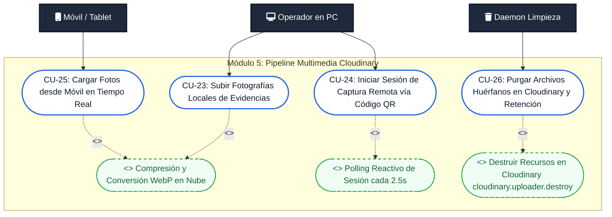

---

### CU-23: Subir Fotografías Locales de Evidencias (PC)
- **Actores:** Secretaria, Tecnico, Admin_Sucursal, SuperAdmin.
- **Componente Frontend:** `DevicePhotoUploader.jsx`.
- **Precondiciones:** Archivos de imagen en la PC del operador.
- **Flujo Principal:**
  1. El operador arrastra o selecciona hasta 5 fotografías en la zona interactiva.
  2. Las fotos se canalizan de forma unificada mediante la sesión de subida (`POST /api/upload-session/:sessionId/subir`) o endpoint directo, transformándolas a WebP en Cloudinary (**<<include>> Compresión y Conversión WebP en Nube**).
  3. Las miniaturas se proyectan reactivamente en pantalla.
  4. Si el operador descarta una fotografía antes de guardar la orden, el sistema invoca inmediatamente `DELETE /api/upload-session/foto`, destruyendo el archivo en Cloudinary en tiempo real.

---

### CU-24: Iniciar Sesión de Captura Remota vía Código QR
- **Actores:** Operador en mostrador o laboratorio.
- **Componentes:** `DevicePhotoUploader.jsx`, `QrUploadModal.jsx`.
- **Flujo Principal:**
  1. El operador hace clic en "Tomar con el Celular" en el cargador de evidencias.
  2. El cliente solicita al backend la inicialización de una sesión (`POST /api/upload-session/crear`) indicando el cupo disponible (`maxFotosPermitidas`).
  3. El backend genera un identificador criptográfico UUID v4, almacena la sesión en `sesiones_carga_fotos` con vigencia de 15 minutos y devuelve la URL de subida.
  4. La interfaz renderiza el código QR dinámico y activa el sondeo continuo desacoplado en segundo plano (**<<include>> Polling Reactivo de Sesión cada 2.5s**).

---

### CU-25: Cargar Fotos desde Móvil en Tiempo Real
- **Actores:** Operador con smartphone o tablet.
- **Página Frontend:** `UploadMobilePage.jsx`.
- **Precondiciones:** Sesión QR activa y no expirada.
- **Flujo Principal:**
  1. El operador escanea el código QR abriendo la página móvil ligera.
  2. El sistema valida que la sesión esté en estado `PENDIENTE` y calcula el límite disponible.
  3. El operador toma fotografías físicas del equipo y presiona "Subir Fotos".
  4. El móvil transmite las imágenes mediante `POST /api/upload-session/:sessionId/subir`.
  5. El backend sube las imágenes a Cloudinary, actualiza el JSONB en `sesiones_carga_fotos` y conmuta el estado a `COMPLETADO`.
  6. El sondeo en la PC detecta la llegada de las fotos, hidrata las miniaturas en la orden y emite una notificación de éxito vía toast.

---

### CU-26: Purgar Archivos Huérfanos en Cloudinary y Retención Histórica
- **Actores:** Daemon de sistema (Cron programado cada 30 minutos), SuperAdmin (CLI manual).
- **Herramienta CLI:** `backend/src/scripts/purgar_huerfanas_cloudinary.js`.
- **Flujo Principal:**
  1. El proceso background consulta en PostgreSQL todas las sesiones en `sesiones_carga_fotos` cuyo estado NO sea `UTILIZADA` y cuya fecha de expiración supere los 30 minutos de antigüedad.
  2. Para cada sesión abandonada, extrae los `public_id` de Cloudinary e invoca la destrucción física (**<<include>> Destruir Recursos en Cloudinary cloudinary.uploader.destroy**).
  3. Actualiza el estado de las sesiones a `PURGADA` y vacía el arreglo de fotos.
  4. Ejecuta la política de retención histórica: elimina definitivamente los registros de `sesiones_carga_fotos` en estado `PURGADA` o `UTILIZADA` con más de 15 días de antigüedad.
  5. El script CLI administrativo permite realizar una conciliación exhaustiva entre Cloudinary y PostgreSQL, reportando y eliminando activos huérfanos con más de 2 horas.

---

## 8. Módulo 6: Consulta Pública y Seguimiento de Órdenes

Este módulo provee acceso web transparente y sin necesidad de credenciales para que los clientes consulten el progreso técnico de sus dispositivos en tiempo real.

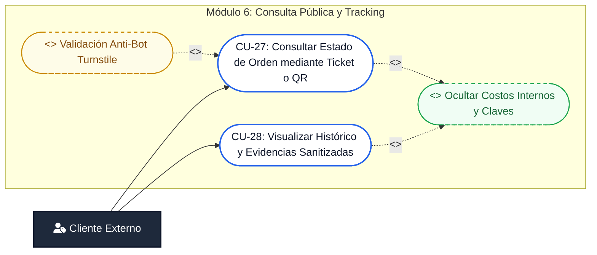

---

### CU-27: Consultar Estado de Orden mediante Ticket o Escaneo QR
- **Actores:** Cliente final.
- **Endpoint:** `GET /api/servicios/ticket/:codigo`.
- **Página Frontend:** `EstadoOrdenPage.jsx`.
- **Flujo Principal:**
  1. El cliente escanea el código QR impreso en su comprobante o ingresa el código del ticket en el portal público (`/estado`).
  2. Si está activo, el sistema valida el token de Cloudflare Turnstile (**<<extend>> Validación Anti-Bot Turnstile**).
  3. El backend recupera la orden y filtra estrictamente información confidencial (**<<include>> Ocultar Costos Internos y Claves**): se omiten PIN/patrón de desbloqueo, notas internas y márgenes de ganancia.
  4. La interfaz renderiza el stepper interactivo con la etapa actual del equipo (`Recibido`, `En Diagnóstico`, `En Reparación`, `Control de Calidad`, `Listo para Entrega`, `Entregado`).
  5. **Soporte Transparente de Órdenes Canceladas:** Si la orden se encuentra cancelada (`CANCELADO_DEVUELTO`), el endpoint responde con código `200 OK` proyectando el motivo de cancelación y marcando el stepper con un nodo terminal rojo, permitiendo que el cliente conozca el desenlace de su equipo con total transparencia.

---

### CU-28: Visualizar Histórico y Evidencias Sanitizadas
- **Actores:** Cliente final.
- **Flujo Principal:**
  1. En el portal público, el cliente accede a la pestaña de evidencias e historial.
  2. El sistema proyecta la galería de fotografías de recepción y entrega sanitizadas.
  3. Se muestra la cronología de hitos temporales (fecha y hora en que entró a cada estado) garantizando la trazabilidad del servicio.

---

## 9. Matriz de Trazabilidad Cruzada: Casos de Uso vs. Actores y Permisos (RBAC)

La siguiente matriz sintetiza el mapa de permisos y responsabilidades implementado en el sistema cubriendo la totalidad de los 28 casos de uso:

| Módulo | Código CU | Denominación del Caso de Uso | SuperAdmin | Admin_Sucursal | Secretaria | Tecnico | Cliente |
| :--- | :--- | :--- | :---: | :---: | :---: | :---: | :---: |
| **IAM** | **CU-01** | Iniciar Sesión en el Sistema | **X** | **X** | **X** | **X** | — |
| | **CU-02** | Consultar y Validar Perfil Activo | **X** | **X** | **X** | **X** | — |
| | **CU-03** | Aplicar Control de Acceso RBAC | *Sistema* | *Sistema* | *Sistema* | *Sistema* | — |
| **Sucursales** | **CU-04** | Administrar Empresa y Sucursales | **X** (Total) | **X** (Local) | *Lectura* | — | — |
| | **CU-05** | Registrar y Gestionar Trabajadores | **X** (Total) | **X** (Local) | *Lectura* | *Lectura* | — |
| | **CU-06** | Asignar y Cargar Avatar de Perfil | **X** | **X** | — | — | — |
| | **CU-07** | Inspeccionar Expediente 360° Trabajador | **X** | **X** | *Lectura* | *Lectura* | — |
| **Recepción** | **CU-08** | Registrar o Actualizar Cliente | **X** | **X** | **X** | *Lectura* | — |
| | **CU-09** | Inspeccionar Expediente 360° Cliente | **X** | **X** | **X** | *Lectura* | — |
| | **CU-10** | Crear Orden de Servicio (Ticket) | **X** | **X** | **X** | **Bloqueo 403** | — |
| | **CU-11** | Visualizar e Inspeccionar 360° Orden | **X** | **X** | **X** | **X** | — |
| | **CU-12** | Edición Controlada de Orden | **X** | **X** | — | **Bloqueo 403** | — |
| | **CU-13** | Cancelación Formal de Orden | **X** | **X** | **Bloqueo 403** | **Bloqueo 403** | — |
| | **CU-14** | Validar Reingreso por Garantía | **X** | **X** | **X** | — | — |
| | **CU-15** | Emitir Comprobante y Stickers QR | **X** | **X** | **X** | — | — |
| **Taller** | **CU-16** | Gestionar Tablero Kanban / Tabla | **X** | **X** | *Lectura* | **X** | — |
| | **CU-17** | Inspección Ficha Técnica / Patrón PIN | **X** | **X** | *Lectura* | **X** | — |
| | **CU-18** | Transicionar Estado Operativo | **X** | **X** | — | **X** | — |
| | **CU-19** | Asignar y Colaborar Multi-Técnico | **X** | **X** | — | **X** | — |
| | **CU-20** | Reportar Incidencia / Sobrecosto | **X** | **X** | — | **X** | — |
| | **CU-21** | Gestionar Aprobación Presupuesto | **X** | **X** | **X** | — | **X** |
| | **CU-22** | Liquidación y Entrega de Dispositivo | **X** | **X** | **X** | **Bloqueo** | — |
| **Multimedia**| **CU-23** | Subir Fotografías Locales (PC) | **X** | **X** | **X** | **X** | — |
| | **CU-24** | Iniciar Sesión Remota QR | **X** | **X** | **X** | **X** | — |
| | **CU-25** | Cargar Fotos desde Móvil | **X** | **X** | **X** | **X** | — |
| | **CU-26** | Purgar Archivos Huérfanos y Retención | **X** | *Automático* | *Automático* | *Automático* | — |
| **Público** | **CU-27** | Consultar Estado por Ticket / QR | — | — | — | — | **X** |
| | **CU-28** | Visualizar Historial Sanitizado | — | — | — | — | **X** |

---

## 10. Conclusiones y Valor Arquitectónico

La especificación de casos de uso estructurada en este documento demuestra la solidez del diseño arquitectónico de **SIGER-FMC**:
1. **Seguridad Defensiva y Mínimo Privilegio:** Se segregan rígidamente las funciones de mostrador (creación de órdenes, anulación y cobros monetarios) de las funciones de laboratorio técnico (diagnóstico, desbloqueo y reporte de fallas), evitando conflictos de interés y desajustes en caja.
2. **Integridad de Datos Inmutable:** Cada avance de etapa en taller, edición administrativa y cancelación formal alimenta registros no modificables en PostgreSQL (`historial_estados`), protegiendo a la empresa ante controversias de tiempos o responsabilidades.
3. **Resiliencia Operativa y Cero Desperdicio:** La gestión multimedia combina la compresión WebP para ahorro de ancho de banda con un recolector de basura automatizado que previene costos innecesarios en almacenamiento en la nube por sesiones no concretadas.

---

## 11. Diagramas de Flujo de Procesos Operativos (Flowcharts del Sistema)

A continuación se presentan los diagramas de flujo interactivos modelados con sintaxis Mermaid para los procesos operativos centrales:

### 11.1. Flujo 1: Autenticación, Verificación Criptográfica y Aislamiento por Sucursal (RBAC)
Ilustra el proceso de inicio de sesión, verificación criptográfica de credenciales y la inyección automática del aislamiento multi-sucursal en cada consulta subsecuente.

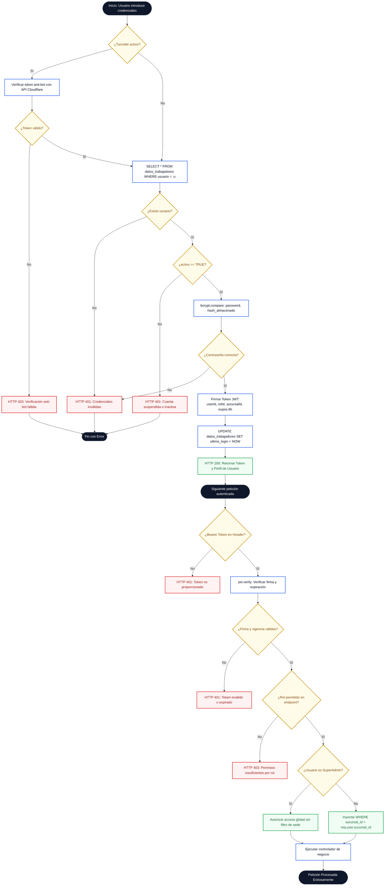

---

### 11.2. Flujo 2: Admisión y Recepción de Equipos (Checklist, Anticipo y Ticket)
Representa el flujo de mostrador para el ingreso de un dispositivo, registro de fallas, verificación de garantía, captura de fotos y emisión de ticket térmico.

```mermaid
flowchart TD
    classDef startEnd fill:#0f172a,stroke:#1e293b,stroke-width:2px,color:#ffffff;
    classDef stepNode fill:#ffffff,stroke:#2563eb,stroke-width:2px,color:#0f172a;
    classDef decisionNode fill:#fefce8,stroke:#ca8a04,stroke-width:2px,color:#854d0e;
    classDef errorNode fill:#fef2f2,stroke:#dc2626,stroke-width:2px,color:#991b1b;
    classDef successNode fill:#f0fdf4,stroke:#16a34a,stroke-width:2px,color:#166534;

    InicioRec([Inicio: Cliente solicita ingreso de equipo]):::startEnd --> CheckRole{¿Rol es Tecnico?}:::decisionNode
    CheckRole -- Sí --> BlockTec[HTTP 403: Técnicos no tienen permisos de recepción]:::errorNode
    BlockTec --> FinErrorRec([Fin con Bloqueo]):::startEnd

    CheckRole -- No --> SearchClient[Buscar cliente por Cédula, RNC o Teléfono]:::stepNode
    SearchClient --> ClientExists{¿Cliente registrado?}:::decisionNode
    ClientExists -- No --> CreateClient[Registrar nuevo cliente en tabla clientes]:::stepNode
    ClientExists -- Sí --> LoadClient[Precargar datos del cliente]:::stepNode

    CreateClient --> CapDevice[Capturar datos del equipo:
Marca, Modelo, Serial / IMEI]:::stepNode
    LoadClient --> CapDevice

    CapDevice --> IsWarranty{¿Es reingreso por Garantía?}:::decisionNode
    IsWarranty -- Sí --> ValidatePrevTicket[Consultar ticket previo original en BD]:::stepNode
    ValidatePrevTicket --> PrevStateOk{¿Orden original ENTREGADO
y dentro de días de cobertura?}:::decisionNode
    PrevStateOk -- No --> RejectWarranty[Rechazar cobertura de garantía gratuita]:::errorNode
    RejectWarranty --> SetPresupuesto[Establecer costo previsto normal]:::stepNode
    PrevStateOk -- Sí --> MarkWarranty[Marcar es_garantia = TRUE,
costo_previsto = 0.00 RD$]:::stepNode

    IsWarranty -- No --> SetPresupuesto
    MarkWarranty --> CapSecurity[Registrar datos de seguridad:
Patrón gestual 3x3 o PIN numérico]:::stepNode
    SetPresupuesto --> CapSecurity

    CapSecurity --> FillChecklist[Completar Checklist de componentes:
OK, Falla, Sin Revisar]:::stepNode
    FillChecklist --> FillDeliveryDate[Seleccionar Fecha Estimada de Entrega:
Componente DatePicker minDate = Hoy]:::stepNode
    FillDeliveryDate --> CheckDateValid{¿Fecha >= Hoy?}:::decisionNode
    CheckDateValid -- No --> DateError[Error: Fecha no puede ser en el pasado]:::errorNode
    DateError --> FillDeliveryDate

    CheckDateValid -- Sí --> UploadChoice{¿Cargar fotos físicas?}:::decisionNode
    UploadChoice -- Subida Móvil QR --> GenQRSession[Crear sesión en sesiones_carga_fotos
y escanear QR móvil]:::stepNode
    UploadChoice -- Subida PC Directa --> DropzonePC[Arrastrar imágenes locales a DevicePhotoUploader]:::stepNode
    UploadChoice -- Omitir Fotos --> OpenSQLTx[Iniciar Transacción SQL: BEGIN]:::stepNode

    GenQRSession --> PollSync[Polling detecta fotos subidas a Cloudinary]:::stepNode
    DropzonePC --> PollSync
    PollSync --> OpenSQLTx

    OpenSQLTx --> GenSeqCode[Generar código ticket único secuencial FMC-YYYY-XXXX]:::stepNode
    GenSeqCode --> InsertMaster[INSERT INTO servicios_recepcion:
estado = RECIBIDO, anticipo, prioridad]:::stepNode
    InsertMaster --> InsertHist[INSERT INTO historial_estados:
Registro inicial de recepción]:::stepNode
    InsertHist --> LinkPhotos[INSERT INTO evidencias_fotograficas
y UPDATE sesiones_carga_fotos = UTILIZADA]:::stepNode
    LinkPhotos --> CommitSQL[COMMIT Transaction SQL]:::successNode

    CommitSQL --> ThermalPrompt{¿Imprimir Comprobante Físico?}:::decisionNode
    ThermalPrompt -- Sí --> PrintTicket[Desplegar plantilla térmica 80mm/58mm
con código QR y stickers para equipo]:::stepNode
    ThermalPrompt -- No --> FinRecExito([Orden Creada y Lista para Taller]):::startEnd
    PrintTicket --> FinRecExito
```

---

### 11.3. Flujo 3: Banco de Trabajo Técnico (Taller Kanban, Guardas y Transiciones)
Describe la dinámica del laboratorio técnico, validación de técnicos asignados obligatorios y el avance controlado entre etapas de diagnóstico y reparación.

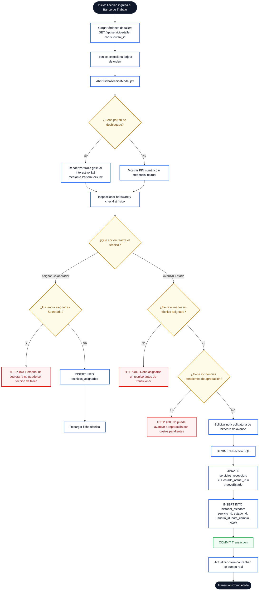

---

### 11.4. Flujo 4: Gestión de Incidencias Técnicas y Aprobación de Presupuestos
Describe la detección de costos imprevistos en taller y el protocolo de autorización con el cliente para asegurar la viabilidad contable de la reparación.

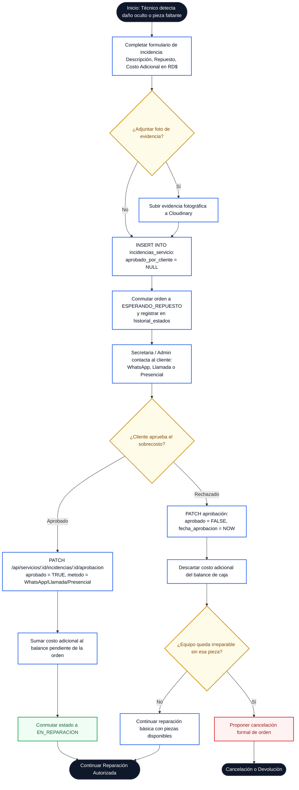

---

### 11.5. Flujo 5: Liquidación Financiera, Cobro en Caja y Entrega con Garantía
Modela el proceso de cobro en mostrador, cálculo de cambio, captura de evidencias de salida, emisión de comprobante térmico oficial y activación de póliza de garantía.

```mermaid
flowchart TD
    classDef startEnd fill:#0f172a,stroke:#1e293b,stroke-width:2px,color:#ffffff;
    classDef stepNode fill:#ffffff,stroke:#2563eb,stroke-width:2px,color:#0f172a;
    classDef decisionNode fill:#fefce8,stroke:#ca8a04,stroke-width:2px,color:#854d0e;
    classDef errorNode fill:#fef2f2,stroke:#dc2626,stroke-width:2px,color:#991b1b;
    classDef successNode fill:#f0fdf4,stroke:#16a34a,stroke-width:2px,color:#166534;

    InicioLiq([Inicio: Cliente acude a retirar su equipo]):::startEnd --> VerifyReady{¿Orden en estado LISTO_ENTREGA?}:::decisionNode
    VerifyReady -- No --> DenyDelivery[HTTP 400: El equipo aún no ha completado el control de calidad]:::errorNode
    DenyDelivery --> FinLiqErr([Entrega No Disponible]):::startEnd

    VerifyReady -- Sí --> OpenLiqModal[Abrir EntregaServicioModal.jsx]:::stepNode
    OpenLiqModal --> CalcNeto[Consolidar Liquidación en Caja:
Balance = Costo Inicial + Incidencias Aprobadas - Anticipo - Descuento]:::stepNode
    CalcNeto --> HasBalance{¿Existe balance pendiente > 0?}:::decisionNode

    HasBalance -- Sí --> SelectPayment[Seleccionar método de pago:
Efectivo, Tarjeta de Crédito, Transferencia Bancaria]:::stepNode
    SelectPayment --> IsCash{¿Pago en Efectivo?}:::decisionNode

    IsCash -- Sí --> CalcDev[Ingresar Monto Recibido:
Sistema calcula Devuelta exacta en RD$]:::stepNode
    IsCash -- No --> RegRef[Ingresar Referencia Bancaria / Voucher]:::stepNode
    CalcDev --> CaptureEvid[Capturar Evidencias de Entrega:
Foto de equipo encendido + chasis limpio]:::stepNode
    RegRef --> CaptureEvid
    HasBalance -- No --> CaptureEvid

    CaptureEvid --> CalcWarranty[Definir Póliza de Garantía:
Ej. 30 días -> Calcular fecha exacta de vencimiento]:::stepNode
    CalcWarranty --> CloseNotes[Ingresar Observaciones de Cierre y Conformidad del Cliente]:::stepNode
    CloseNotes --> BeginTxLiq[BEGIN Transaction SQL]:::stepNode

    BeginTxLiq --> UpdMaster[UPDATE servicios_recepcion:
estado_actual_id = 7 (ENTREGADO),
fecha_entrega_real = NOW(), monto_liquidado]:::stepNode
    UpdMaster --> InsHistEnt[INSERT INTO historial_estados:
Cierre por entrega con usuario responsable]:::stepNode
    InsHistEnt --> InsFotosEnt[INSERT INTO evidencias_fotograficas:
tipo_evidencia = 'ENTREGA']:::stepNode
    InsFotosEnt --> CommitLiq[COMMIT Transaction]:::successNode

    CommitLiq --> PrintReceipt[Desplegar Modal de Impresión:
Recibo de Entrega y Liquidación con Términos de Garantía]:::stepNode
    PrintReceipt --> FirmaCli[Firma física/digital de conformidad del cliente]:::stepNode
    FirmaCli --> FinEntExito([Dispositivo Entregado y Liquidado]):::startEnd
```

---

### 11.6. Flujo 6: Pipeline Multimedia Móvil (QR) y Limpieza de Huérfanos (Garbage Collector)
Ilustra el ciclo asíncrono e inalámbrico de captura fotográfica vía dispositivo móvil y el mecanismo defensivo de recolección de basura (*Garbage Collector*) para eliminar archivos abandonados en Cloudinary.

```mermaid
flowchart TD
    classDef startEnd fill:#0f172a,stroke:#1e293b,stroke-width:2px,color:#ffffff;
    classDef stepNode fill:#ffffff,stroke:#2563eb,stroke-width:2px,color:#0f172a;
    classDef decisionNode fill:#fefce8,stroke:#ca8a04,stroke-width:2px,color:#854d0e;
    classDef errorNode fill:#fef2f2,stroke:#dc2626,stroke-width:2px,color:#991b1b;
    classDef successNode fill:#f0fdf4,stroke:#16a34a,stroke-width:2px,color:#166534;

    InicioQR([Inicio: Operador solicita carga móvil de fotos]):::startEnd --> GenUUID[Generar session_id criptográfico UUID v4]:::stepNode
    GenUUID --> InsSession[INSERT INTO sesiones_carga_fotos:
estado = 'PENDIENTE', expira_en = NOW + 15 min]:::stepNode
    InsSession --> ShowQR[Mostrar Código QR dinámico en pantalla de PC:
URL: /subir-fotos/:sessionId]:::stepNode
    ShowQR --> StartPoll[PC inicia Polling reactivo cada 2.5s:
GET /api/upload-session/:sessionId]:::stepNode

    ShowQR --> ScanMobile[Operador escanea QR con móvil o tablet]:::stepNode
    ScanMobile --> OpenMobileUI[Móvil abre interfaz ligera UploadMobilePage.jsx]:::stepNode
    OpenMobileUI --> CheckExp{¿Sesión expirada?}:::decisionNode
    
    CheckExp -- Sí --> ExpMsg[Notificar expiración:
Solicitar nuevo código QR en PC]:::errorNode
    ExpMsg --> FinQRFail([Sesión Caducada]):::startEnd

    CheckExp -- No --> PickPhotos[Operador toma fotos o selecciona de galería
(hasta límite efectivo)]:::stepNode
    PickPhotos --> SendMobile[POST /api/upload-session/:sessionId/subir]:::stepNode
    SendMobile --> CloudTry{¿Cloudinary disponible
y cuota activa?}:::decisionNode

    CloudTry -- Sí --> UpCloud[Subida y compresión WebP en Cloudinary:
Retorna secure_url y public_id]:::stepNode
    CloudTry -- No --> UpLocalFall[Fallback Resiliente a Data URI Base64:
public_id = local-timestamp]:::stepNode

    UpCloud --> UpdSessionBD[UPDATE sesiones_carga_fotos:
SET fotos = fotos || nuevas, estado = 'COMPLETADO']:::stepNode
    UpLocalFall --> UpdSessionBD

    UpdSessionBD --> PollDetect[Polling en PC detecta estado COMPLETADO]:::successNode
    PollDetect --> RenderPreview[PC hidrata miniaturas de fotos en la orden
y emite notificación visual]:::stepNode

    RenderPreview --> UserAction{¿Qué hace el operador en la PC?}:::decisionNode

    UserAction -- Descarta foto individual --> DeleteDirect[DELETE /api/upload-session/foto
Destruir inmediatamente en Cloudinary]:::stepNode
    DeleteDirect --> RenderPreview

    UserAction -- Guarda Orden formalmente --> SaveServicio[POST /api/servicios
Persistir orden con fotos vinculadas]:::stepNode
    SaveServicio --> MarkUtilizada[UPDATE sesiones_carga_fotos
SET estado = 'UTILIZADA']:::successNode
    MarkUtilizada --> FinProtected([Fotos protegidas de por vida]):::startEnd

    UserAction -- Cancela / Cierra pestaña --> AbandonSession[Sesión queda huérfana en estado COMPLETADO
y supera expira_en]:::errorNode
    AbandonSession --> DaemonCron[Daemon de Limpieza (cada 30 min) o Script CLI:
purgarSesionesExpiradas]:::stepNode
    DaemonCron --> FindOrphans[SELECT sesiones WHERE estado NOT IN ('UTILIZADA', 'PURGADA')
AND expira_en < NOW - 30 min]:::stepNode
    FindOrphans --> DestroyCloud[Llamar cloudinary.uploader.destroy para cada foto]:::stepNode
    DestroyCloud --> PurgeSession[UPDATE sesiones_carga_fotos
SET estado = 'PURGADA', fotos = '[]'::jsonb]:::successNode
    PurgeSession --> CleanDB15[DELETE FROM sesiones_carga_fotos
WHERE estado IN ('PURGADA', 'UTILIZADA')
AND created_at < NOW - 15 days]:::stepNode
    CleanDB15 --> FinPurged([Almacenamiento en Cloudinary y BD liberado]):::startEnd
```

---

### 11.7. Flujo 7: Edición Controlada de Orden de Servicio y Matriz de Congelación
Ilustra el proceso de modificación administrativa de tickets, validando el rol del operador, el estado de avance en taller para congelar datos de hardware y la persistencia de auditoría.

```mermaid
flowchart TD
    classDef startEnd fill:#0f172a,stroke:#1e293b,stroke-width:2px,color:#ffffff;
    classDef stepNode fill:#ffffff,stroke:#2563eb,stroke-width:2px,color:#0f172a;
    classDef decisionNode fill:#fefce8,stroke:#ca8a04,stroke-width:2px,color:#854d0e;
    classDef errorNode fill:#fef2f2,stroke:#dc2626,stroke-width:2px,color:#991b1b;
    classDef successNode fill:#f0fdf4,stroke:#16a34a,stroke-width:2px,color:#166534;

    InicioEdit([Inicio: Operador hace clic en Editar Orden]):::startEnd --> CheckEditRole{¿Rol es Tecnico?}:::decisionNode
    CheckEditRole -- Sí --> BlockTecEdit[HTTP 403: Técnicos no tienen permisos de edición de orden]:::errorNode
    BlockTecEdit --> FinEditErr([Operación Denegada]):::startEnd

    CheckEditRole -- No --> LoadEditData[Consultar orden actual y sucursal]:::stepNode
    LoadEditData --> CheckTerminal{¿Estado es ENTREGADO
o CANCELADO_DEVUELTO?}:::decisionNode
    CheckTerminal -- Sí --> BlockTerminal[HTTP 400: No es posible editar una orden finalizada o cancelada]:::errorNode
    BlockTerminal --> FinEditErr

    CheckTerminal -- No --> CheckWorkshopPhase{¿Orden avanzó a Taller?
(EN_DIAGNOSTICO, REPARACION, etc.)}:::decisionNode

    CheckWorkshopPhase -- Sí --> FreezeHardware[Congelar Hardware y Falla en modo readOnly:
Mostrar banner minimalista de advertencia
Habilitar Seguridad, Fecha, Prioridad, Observaciones]:::stepNode
    CheckWorkshopPhase -- No --> FullEdit[Habilitar Edición Completa:
Hardware, Falla, Categoría, Costo, Seguridad, Fecha]:::stepNode

    FreezeHardware --> FormInput[Operador modifica los campos permitidos]:::stepNode
    FullEdit --> FormInput

    FormInput --> CheckEditDate{¿Fecha Estimada >= Hoy?}:::decisionNode
    CheckEditDate -- No --> ErrEditDate[Notificar advertencia: Fecha no puede ser anterior a hoy]:::errorNode
    ErrEditDate --> FormInput

    CheckEditDate -- Sí --> SubmitEdit[PUT /api/servicios/:id]:::stepNode
    SubmitEdit --> BeginEditTx[BEGIN Transaction SQL]:::stepNode
    BeginEditTx --> BuildSQL[Construir UPDATE dinámico según campos modificados]:::stepNode
    BuildSQL --> ExecUpdate[Ejecutar UPDATE servicios_recepcion]:::stepNode
    ExecUpdate --> RecordAudit[INSERT INTO historial_estados:
Registrar campos actualizados y usuario_id]:::stepNode
    RecordAudit --> CommitEditTx[COMMIT Transaction]:::successNode
    CommitEditTx --> ReturnEnriched[Retornar entidad enriquecida con todas sus relaciones]:::successNode
    ReturnEnriched --> RefreshUI[Actualizar tabla de servicios reactivamente sin recarga]:::stepNode
    RefreshUI --> FinEditOk([Edición Guardada y Auditada]):::startEnd
```

---

### 11.8. Flujo 8: Cancelación Formal de Orden de Servicio y Salvaguardas Defensivas
Modela la anulación formal por inviabilidad técnica o rechazo de presupuesto, asegurando la inmutabilidad de la baja y los bloqueos defensivos en cascada.

```mermaid
flowchart TD
    classDef startEnd fill:#0f172a,stroke:#1e293b,stroke-width:2px,color:#ffffff;
    classDef stepNode fill:#ffffff,stroke:#2563eb,stroke-width:2px,color:#0f172a;
    classDef decisionNode fill:#fefce8,stroke:#ca8a04,stroke-width:2px,color:#854d0e;
    classDef errorNode fill:#fef2f2,stroke:#dc2626,stroke-width:2px,color:#991b1b;
    classDef successNode fill:#f0fdf4,stroke:#16a34a,stroke-width:2px,color:#166534;

    InicioCanc([Inicio: Operador solicita Cancelar Orden]):::startEnd --> CheckCancRole{¿Rol es SuperAdmin
o Admin_Sucursal?}:::decisionNode
    CheckCancRole -- No --> BlockCancRole[HTTP 403: No tienes permisos para desactivar órdenes de servicio]:::errorNode
    BlockCancRole --> FinCancErr([Cancelación Denegada]):::startEnd

    CheckCancRole -- Sí --> OpenCancModal[Abrir CancelarOrdenModal.jsx]:::stepNode
    OpenCancModal --> PromptReason[Exigir motivo_cancelacion justificado
(mínimo 5 caracteres)]:::stepNode
    PromptReason --> CheckReasonLength{¿Motivo >= 5 caracteres?}:::decisionNode
    CheckReasonLength -- No --> ErrReason[Bloquear confirmación en modal]:::errorNode
    ErrReason --> PromptReason

    CheckReasonLength -- Sí --> SubmitCanc[POST /api/servicios/:id/cancelar]:::stepNode
    SubmitCanc --> BeginCancTx[BEGIN Transaction SQL con SELECT FOR UPDATE]:::stepNode
    BeginCancTx --> CheckCancTerminal{¿Orden ya entregada o cancelada?}:::decisionNode
    CheckCancTerminal -- Sí --> ErrCancTerminal[HTTP 400: Orden no es elegible para cancelación]:::errorNode
    ErrCancTerminal --> RollbackCanc[ROLLBACK Transaction]:::errorNode
    RollbackCanc --> FinCancErr

    CheckCancTerminal -- No --> ExecCancSQL[UPDATE servicios_recepcion:
estado_actual_id = 8 (CANCELADO_DEVUELTO),
motivo_cancelacion, fecha_cancelacion = NOW,
usuario_cancela_id]:::stepNode
    ExecCancSQL --> InsAuditCanc[INSERT INTO historial_estados:
Cierre por cancelación formal con motivo]:::stepNode
    InsAuditCanc --> CommitCancTx[COMMIT Transaction]:::successNode

    CommitCancTx --> ActivateGuards[Activar Salvaguardas Defensivas del Sistema]:::stepNode
    ActivateGuards --> Guard1[Taller: Bloqueo de avance de estado, incidencias y técnicos (HTTP 400)]:::stepNode
    ActivateGuards --> Guard2[Impresión: Bloqueo de emisión de tickets y etiquetas (HTTP 400)]:::stepNode
    ActivateGuards --> Guard3[Consulta Pública: Proyección transparente del motivo y nodo terminal rojo]:::stepNode
    Guard1 --> FinCancOk([Orden Cancelada y Blindada]):::startEnd
    Guard2 --> FinCancOk
    Guard3 --> FinCancOk
```

---

### 11.9. Flujo 9: Inspección y Expediente 360° (Clientes, Trabajadores y Órdenes)
Describe la navegación segura de solo lectura para auditar expedientes completos de clientes, colaboradores y órdenes técnicas sin riesgo de alteración accidental.

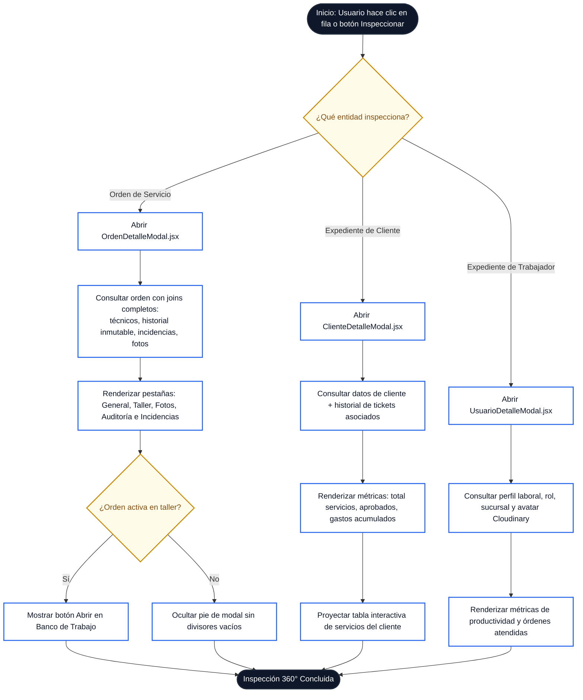
